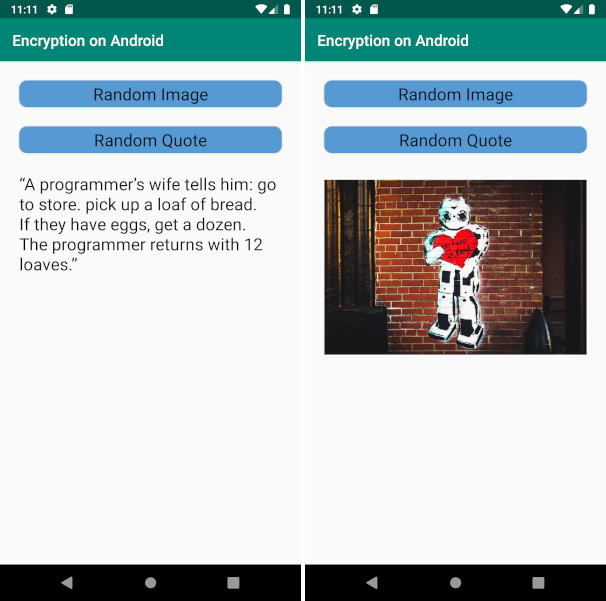

# Resource Encryption use in an Android App

This [sample app](#sample_desc) for Android&trade; illustrates the use of Resource Encryption in _PreEmptive Protection™ DashO™_.
This project can be imported into Android Studio.
[Control Flow Obfuscation](https://www.preemptive.com/dasho/pro/userguide/en/understanding_obfuscation_control.html), [String Encryption](https://www.preemptive.com/dasho/pro/userguide/en/understanding_obfuscation_string_encryption.html), and [Resource Encryption](https://www.preemptive.com/dasho/pro/userguide/en/understanding_obfuscation_resource_encryption.html) are handled via the [DashO Gradle Plugin for Android](https://www.preemptive.com/dasho/pro/userguide/en/ref_dagp_index.html) integration.
Renaming Obfuscation and Removal are handled by [R8](https://r8-docs.preemptive.com/).

This sample is configured with both asset and raw resource encryption on the release builds.

## Setup

See the main [README](../README.md) for the requirements.

## Build Without Resource Encryption

Compile, obfuscate, and install the debug version of the application.

1.  Run the command: `gradlew uninstallAll` _(if necessary)_
2.  Run the command: `gradlew installDebug`

If you [check](#check_encryption) for encryption, you will see neither `res/raw/quotes.txt` nor the images in `assets/img` have been encrypted.

## Build With Resource Encryption

Compile, obfuscate, and install the release version of the application.

1.  Run the command: `gradlew uninstallAll` _(if necessary)_
2.  Run the command: `gradlew installRelease`

If you [check](#check_encryption) for encryption, you will that `res/raw/quotes.txt` and most of the images in `assets/img` have been encrypted.
The sample configuration does not encrypt the images `allison-*`

## Running the Sample

This sample has two buttons.
The `Random Image` button picks a random image from the `assets/img` directory, determines a sampling size, and displays the image.
A message will display showing the time used to read, decrypt (if needed), and decode the image.
The `Random Quote` button reads `res/raw/quotes.txt` and displays a random quote from that file.

## Checking the Encryption

To verify if the assets and raw resources have, or have not, been encrypted, unzip the apk.
Look at `res/raw/quotes.txt` and the images in `assets/img`.

## How to Add Resource Encryption to Your Android Application

To enable resource encryption, simply [enable](https://www.preemptive.com/dasho/pro/userguide/en/ui_main_resource_encryption.html) the feature in your project and rebuild the application.

Please read through the [limitations](https://www.preemptive.com/dasho/pro/userguide/en/understanding_obfuscation_resource_encryption.html#limitations) and provide [feedback](https://www.preemptive.com/contact/contactus).

## Attributions

Images are from the following contributors on (Unsplash)[https://unsplash.com]:

* (Lance Anderson)[https://unsplash.com/@lanceanderson]
* (Allison Christine)[https://unsplash.com/@happpyal]
* (DJ Johnson)[https://unsplash.com/@dj_johns1]
* (Igor Oliyarnik)[https://unsplash.com/@igorius]
* (Benjamin Suter)[https://unsplash.com/@benjaminjsuter]

The quotes are a subset from <https://github.com/erossignon/qod4outlook/blob/master/quotes.txt>.

>**Note:** The Android robot is reproduced or modified from work created and shared by Google and used according to terms described in the [Creative Commons 3.0 Attribution License](http://creativecommons.org/licenses/by/3.0/).
Android is a trademark of Google Inc.
Gradle is a trademark of Gradle Inc.
