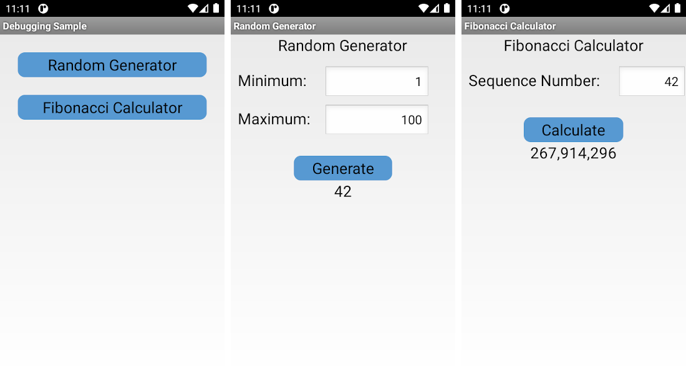

# Android&trade; Samples

## Basic Requirements

* Java 1.8
* Android 10.0 (api 29) SDK platform

>**Note:** The Android-specific requirements can be changed by editing the `build.gradle` file of the particular sample.

## Environment Setup

Before running these samples, they need to know where both the Android SDK and DashO™ are located.
>**Note:** If you import a sample into Android Studio, make sure that Instant Run is [disabled](https://developer.android.com/studio/run/#disable-ir) so that the sample will work correctly.

### Android SDK

Set `sdk.dir` in `local.properties` to the location of the Android SDK.
It can also be set via an [environment variable](https://developer.android.com/studio/command-line/variables.html).

>**Note:** You will need to create the `local.properties` file.
>It should exist in the same directory as the `gradle.properties` file.

### DashO

If *PreEmptive Protection™ DashO for Android & Java* is installed in the default location, the *DashO Gradle Plugin for Android* will find *DashO* automatically, and no explicit configuration is necessary.
Otherwise, see documentation for the [DashO Gradle Plugin for Android](https://www.preemptive.com/dasho/pro/userguide/en/ref_dagp_dasho_home.html) for details about setting DashO Home.

## Samples

* [DashO-GameOfLife](https://github.com/preemptive/DashO-GameOfLife) - A separate repository with a more-complex Android application that includes a library.
* [DebuggingOnAndroid](DebuggingOnAndroid) - An Android application which uses Debug Checking.
* [EmulatorOnAndroid](EmulatorOnAndroid) - An Android application which uses Emulator Checking.
* [HookingOnAndroid](HookingOnAndroid) - An Android application which uses Hook Checking.
* [KotlinOnAndroid](KotlinOnAndroid) - An Android application using Kotlin.
* [RootOnAndroid](RootOnAndroid) - An Android application which uses Root Checking.
* [TamperOnAndroid](TamperOnAndroid) - An Android application which uses Tamper Checking.

### Running the Samples

The included samples have the same basic functionality.

The main screen allows selection of the *Random Generator* or the *Fibonacci Calculator*.
The *Random Generator* generates and displays a random number in a configured range.
The *Fibonacci Calculator* calculates and displays a number in the Fibonacci sequence.
The samples for Checks and Responses attach additional behavior to the `Generate` and `Calculate` actions.
When the Check is triggered, those areas of the application will not work properly.

#### Notification

Each of the sample apps is designed to detect certain configuration issues.
In the case that something does go wrong, a message will be displayed in a toast whenever either the *Random Generator* or *Fibonacci Calculator* are selected from the main activity.
If you see these messages unexpectedly, please review the `README.md` for the sample and review any changes you may have made to the configuration.

Android is a trademark of Google Inc.
